# The Bay Area Housing Market After the 2008 Financial Crisis: Entry, Incumbency, and Circulation

*How changing incomes, prices, financing conditions, and household demographics reshaped access to homeownership from 2007 to 2024.*

## Introduction

The Bay Area is notorious for its high housing prices, and for good reason. In 2024, the median home price in the region reached $1.46 million[^1] – and has continued to rise since. But the story of housing in the Bay Area over the past two decades isn't simply one of rising costs. By far, the most impactful change is the growing stratification between existing homeowners and households attempting to enter the market.

The financial crisis temporarily disrupted that divide. Home prices fell sharply, mortgage rates followed, and for a few years buying became realistic for a much larger share of renters. But the recovery reversed most of that change. Prices rose again through the 2010s, and when mortgage rates climbed after 2021, prospective buyers faced high prices and expensive financing at the same time. Households that already owned their homes were in a very different position, particularly if they had bought years earlier or refinanced when rates were low.

The resulting difference is apparent throughout the housing market. Fewer households were able to buy, and those that did were increasingly high-income. Homeowners became older and more likely to have lived in the same home for many years. Existing owners moved relatively little, especially once replacing an older mortgage became much more expensive. At the same time, population loss did less to reduce housing demand than it might appear, because the households remaining in the region became smaller.

| Year | Lower-tier home value | 30-year mortgage rate | Renters meeting both entry tests, 10% down | Financed purchases | Net migration |
| ---: | :-------------------- | :-------------------- | :----------------------------------------- | :----------------- | :------------ |
| 2007 | $606k                 | 6.34%                 | 21.5%                                      | 67.0k              | -15k          |
| 2012 | $356k                 | 3.66%                 | 55.5%                                      | 64.1k              | +17k          |
| 2019 | $776k                 | 3.94%                 | 39.9%                                      | 64.2k              | -52k          |
| 2024 | $793k                 | 6.72%                 | 24.9%                                      | 46.4k              | -59k          |

## The tech boom brought enormous purchasing power into the housing market

The Bay Area's recovery from the financial crisis coincided with the technology boom of the 2010s. Employment expanded, real pay per job rose substantially, and tech workers were paid far more than the rest of the private sector. That gap widened further during the decade, giving a growing part of the region's workforce purchasing power that looked very different from the regional average.

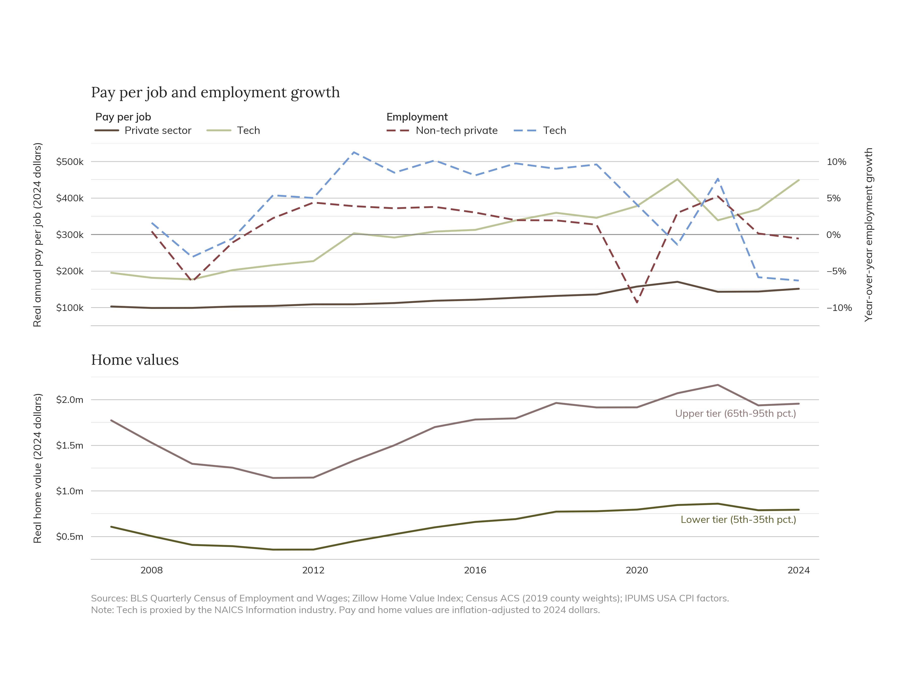

The change was also large enough to affect aggregate income growth. Information made the single largest contribution to the increase in real private-sector pay per job between 2007 and 2024, with professional and technical services also contributing heavily. Much of that came from higher pay within those industries rather than simply a shift in employment toward them.

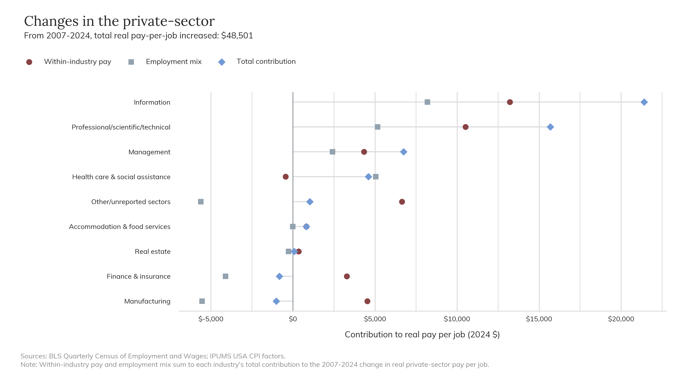

This matters for housing because home prices are not determined by what every household can afford. The technology boom created a large pool of workers earning enough to compete for increasingly expensive homes even while many other households saw much smaller gains. As the economy recovered, home values rose with it and eventually climbed well above their pre-crisis levels. The result was a region that became considerably richer without making homeownership proportionately easier to reach.

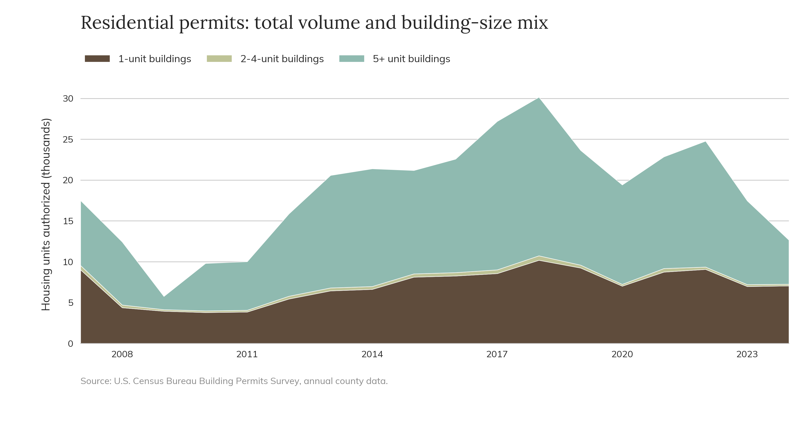

Construction also recovered, although not in a way that produced a clear break in regional housing costs. Single-family construction remained substantial, but most authorized units increasingly came from buildings with five or more units. That shift is not unusual or inherently problematic; in a high-cost, land-constrained region, larger buildings are an important way to add housing. The larger point is that construction remained cyclical. Permitting rose strongly during the recovery and then fell again, while prices and population did not move neatly with the amount of housing being authorized. Rent growth appears to have softened somewhat during the period of strongest multifamily permitting, but the relationship is not strong enough to treat construction volume alone as an explanation for the region's housing costs.

## The financial crisis briefly made homeownership much easier to reach

For households less impacted by the recession with enough income and savings to consider buying, falling home values and mortgage rates made the early 2010s an unusually favorable time for a home purchase.

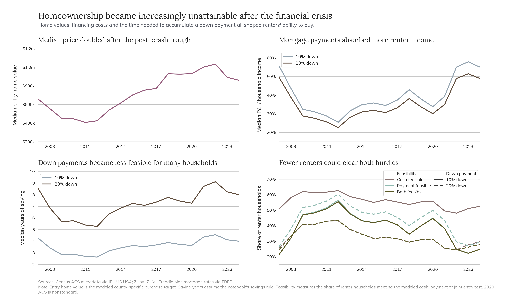

Of course, that improvement didn't last. As home values recovered, the amount needed for a down payment rose and mortgage payments began taking up more of renter income. During most of the 2010s, rising prices did more to reduce access than mortgage rates did. Renters' incomes and savings position improved during parts of the recovery, but generally not enough to offset the increase in home values.

After 2021, the problem changed again. Prices remained high while mortgage rates rose rapidly, so prospective buyers lost much of the financing advantage that had softened high prices during the previous decade. By 2024, the share of renters who could meet both the cash and payment requirements was close to where it had been before the crash, despite very different economic conditions.

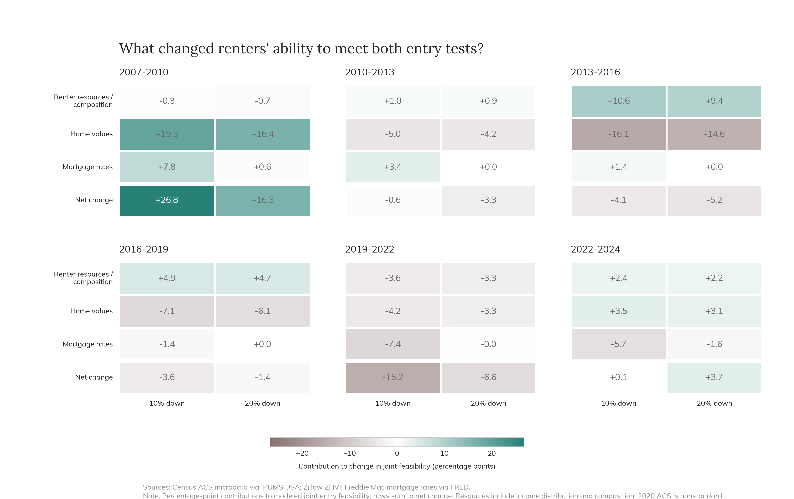

The point is not that affordability simply worsened every year. It did not. The crash created a real period of increased access, and different forces closed it at different times. Rising home values did most of the work during the recovery. Higher interest rates became much more important later.

## The households still buying homes became much richer

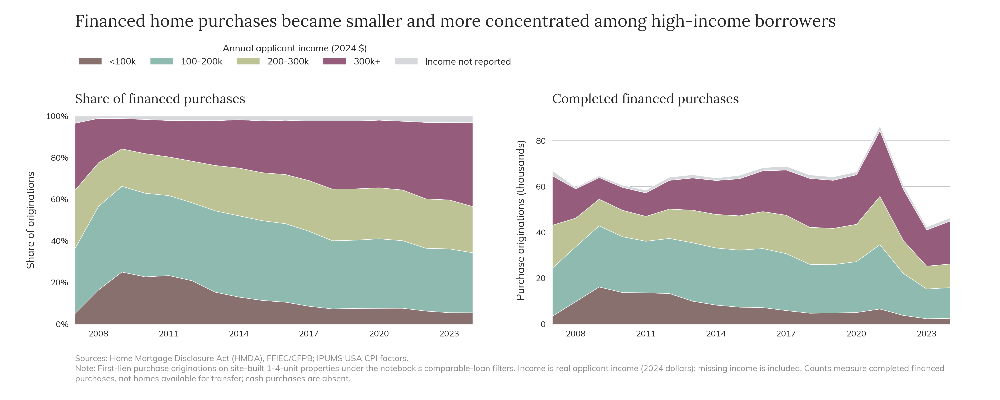

As buying became more difficult, financed home purchases became increasingly concentrated among high-income borrowers. The share of purchases made by applicants earning more than $300,000 rose considerably, while the shares going to borrowers below that level declined.

That shift can be misleading if it is viewed only as a change in shares. The number of purchases fell in every income group between 2007 and 2024. Even purchases by borrowers earning more than $300,000 declined. They simply fell much less than purchases by everyone else.

|      | income_band |  2007 |  2024 | change_2007_2024 |
| ---: | :---------- | ----: | ----: | ---------------: |
|    0 | <100k       |  3438 |  2527 |         -0.26498 |
|    1 | 100-200k    | 20965 | 13390 |        -0.361316 |
|    2 | 200-300k    | 18750 | 10309 |        -0.450187 |
|    3 | 300k+       | 21544 | 18705 |        -0.131777 |

The change in who was buying therefore came partly from households lower down the income distribution dropping out of the market. The pool of buyers did not just become richer because more very high-income households entered it, but because purchasing activity contracted much more sharply among households below them.

## Homeownership also became older and more settled

The composition of homeowners changed alongside the decline in access. Homeownership became less common among younger households, while the number of older homeowners rose substantially. Between 2007 and 2024, the number of homeowners under 50 fell, the number between 50 and 64 was almost unchanged, and the number aged 65 and older increased dramatically.

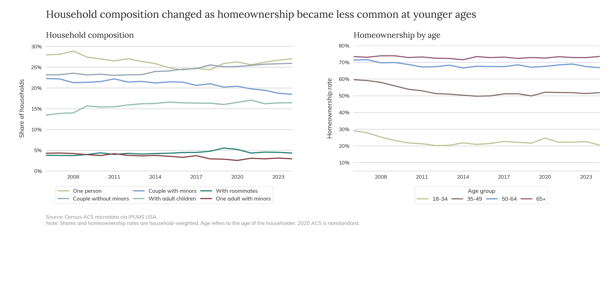

Some of that change is simply demographic. The Bay Area population itself became older, and much of the increase in the share of older homeowners reflects that shift rather than a sudden increase in the likelihood that older households own homes. But age alone does not explain everything. Homeownership rates also declined among younger adults, particularly those under 50.

|      | age_group |   2007 |   2024 | change_2007_2024 |
| ---: | :-------- | -----: | -----: | ---------------: |
|    0 | 18-34     | 126317 | 103176 |           -23141 |
|    1 | 35-49     | 515996 | 419650 |           -96346 |
|    2 | 50-64     | 508353 | 507470 |             -883 |
|    3 | 65+       | 340532 | 567141 |           226609 |

| age_group |     2007 |     2012 |     2019 |     2024 |
| :-------- | -------: | -------: | -------: | -------: |
| 18-34     | 0.278258 | 0.202309 | 0.216811 | 0.204317 |
| 35-49     | 0.590955 | 0.513076 | 0.499103 | 0.518749 |
| 50-64     | 0.715598 | 0.673795 | 0.670791 | 0.667819 |
| 65+       | 0.730234 | 0.724542 | 0.728597 | 0.735026 |

Households were also increasingly likely to remain in the same home for long periods. The share of all households that had lived in their dwelling for at least ten years rose from about 37 percent in 2007 to 44 percent in 2024. The increase occurred among both homeowners and renters, although long residence remained much more common among owners.

| YEAR | tenure     | deep_incumbent_share | deep_incumbent_households |
| ---: | :--------- | :------------------- | :------------------------ |
| 2007 | all        | 36.7%                | 920k                      |
| 2007 | free_clear | 77.7%                | 268k                      |
| 2007 | mortgaged  | 43.2%                | 495k                      |
| 2007 | renter     | 15.5%                | 157k                      |
| 2012 | all        | 40.4%                | 1,059k                    |
| 2012 | free_clear | 76.7%                | 280k                      |
| 2012 | mortgaged  | 54.3%                | 585k                      |
| 2012 | renter     | 16.4%                | 194k                      |
| 2019 | all        | 43.0%                | 1,184k                    |
| 2019 | free_clear | 73.8%                | 352k                      |
| 2019 | mortgaged  | 54.7%                | 576k                      |
| 2019 | renter     | 20.9%                | 256k                      |
| 2024 | all        | 44.1%                | 1,255k                    |
| 2024 | free_clear | 74.8%                | 398k                      |
| 2024 | mortgaged  | 53.7%                | 572k                      |
| 2024 | renter     | 22.8%                | 284k                      |

Taken together, these changes point in the same direction. A growing share of the housing market was occupied by households that had established their housing situation years earlier, while younger households faced a much harder path into ownership.

## Staying in the same home could be much cheaper than moving

The importance of having entered the market earlier becomes clearer when housing costs are compared within the same tenure group. Households that had lived in their dwelling for at least ten years generally spent less on housing than otherwise similar households that had moved in more recently. That was true not only for homeowners, but also for renters.

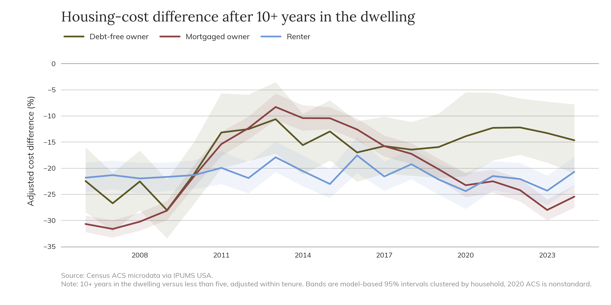

For homeowners, the reason is partly built into how ownership works. A household that bought years earlier may have paid a lower price, accumulated equity, refinanced at a lower rate, or paid off part or all of its mortgage. A renter can also benefit from remaining in place if their rent has risen more slowly than the market price of a new lease. This means that rising housing costs affect households very differently depending on whether they are staying put or trying to recreate their housing situation at current prices. Someone who already has a home does not face the same market as someone trying to buy or rent that home today.

## Rising mortgage rates also made moving more expensive for existing owners

That difference became especially important once mortgage rates increased. For much of the 2010s, buying a comparable home at the prevailing rate could produce a monthly payment similar to, or even lower than, the payment implied by older purchase rates. By 2023 and 2024, the relationship had reversed dramatically. Replacing an older mortgage with a new one could add hundreds of dollars a month in principal and interest even before accounting for any increase in the price of the home itself.

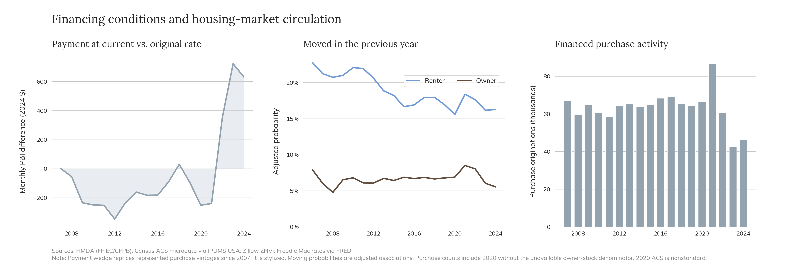

Owners already moved much less frequently than renters, and the financial cost of giving up an older mortgage made moving even less attractive. At the same time, financed purchase activity fell sharply after 2021. These patterns don't mean that mortgage rates alone explain why owners stayed in place. Owner mobility was already low well before rates rose. But the later increase in borrowing costs made an existing home and mortgage more valuable to keep at exactly the same time that new buyers were finding it more difficult to enter the market. Fewer homes changing hands then limited the number of opportunities available to those buyers further.

## Population loss did not equate to weaker housing demand

The Bay Area also began losing far more residents to the rest of the country than it gained. Domestic migration was roughly balanced around the aftermath of the financial crisis, but exits increasingly exceeded entrants during the late 2010s and early 2020s. Movement within the Bay Area also became less common.

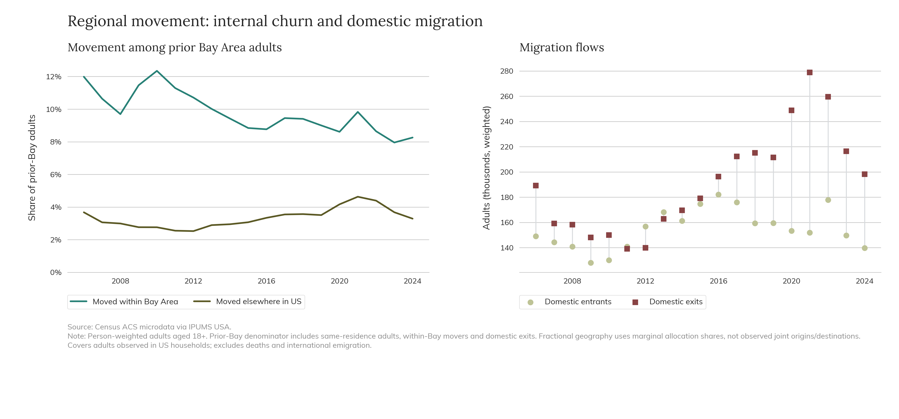

It would be easy to assume that population decline should reduce pressure on the housing market. But people do not occupy homes one at a time. Between 2019 and 2024, the average number of people per occupied home fell enough that the region needed more occupied homes even though its population declined. The effect of smaller households more than offset the reduction in housing demand that would otherwise have come from losing residents.

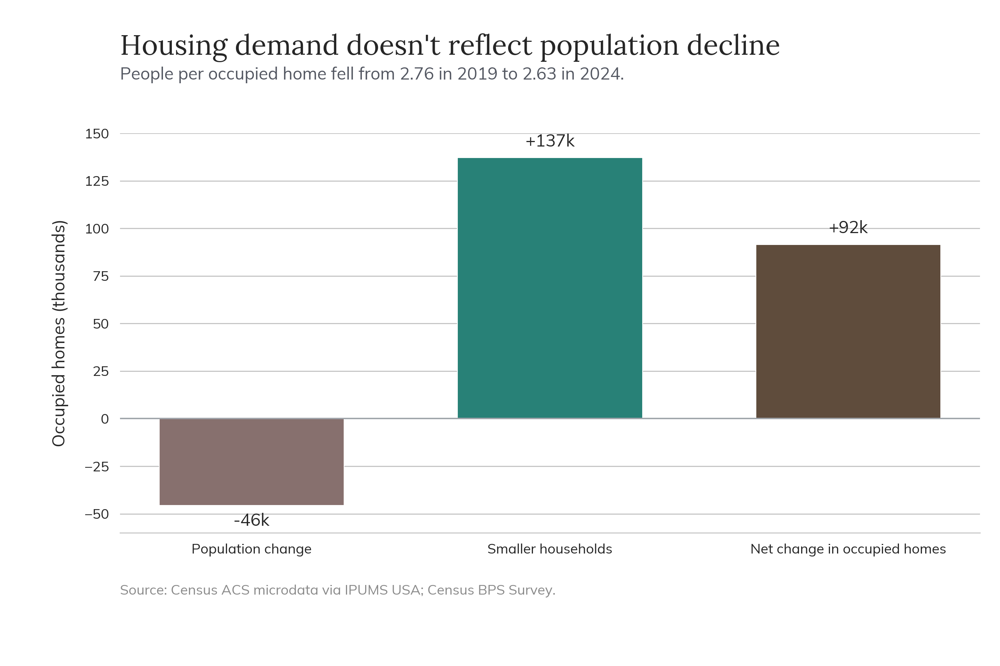

People entering the Bay Area from elsewhere in the country were consistently younger and less likely to live in owner-occupied housing than those leaving. Earlier in the period, entrants and exits also differed more clearly in income. By 2024, however, their average personal incomes were nearly identical while the gap in homeownership remained large.

|      | YEAR | continuity_group | persons |     AGE | personal_income_2024 | share_in_owner_occupied_home |
| ---: | ---: | :--------------- | ------: | ------: | -------------------: | ---------------------------: |
|    6 | 2007 | entrant_domestic |  144306 | 35.2999 |              60492.3 |                      0.31217 |
|    7 | 2007 | exit_domestic    |  159141 | 38.1612 |              58444.6 |                      0.42238 |
|   31 | 2012 | entrant_domestic |  156785 | 34.8107 |              63916.4 |                     0.267334 |
|   32 | 2012 | exit_domestic    |  139893 | 37.5481 |              49616.2 |                     0.275496 |
|   73 | 2019 | entrant_domestic |  159506 | 36.4979 |              87524.6 |                     0.269526 |
|   74 | 2019 | exit_domestic    |  211487 | 39.7507 |                76166 |                     0.425118 |
|  103 | 2024 | entrant_domestic |  139682 | 35.4337 |              76908.7 |                     0.290703 |
|  104 | 2024 | exit_domestic    |  198253 |   39.09 |                75851 |                     0.428251 |

So the region was not simply losing lower-income households while attracting richer replacements. By the end of the period, migration was separating households more clearly by age and housing position than by income alone.

## Moving farther away offered only limited relief

One possible response to high housing costs is to move somewhere cheaper within the region. But Bay Area housing markets moved together to a striking degree. Lower-tier home values rose and fell at similar times across counties, and upper-tier values were only slightly less synchronized. Rent growth varied more from county to county, but there was still no clear part of the region that consistently moved in the opposite direction from the rest.

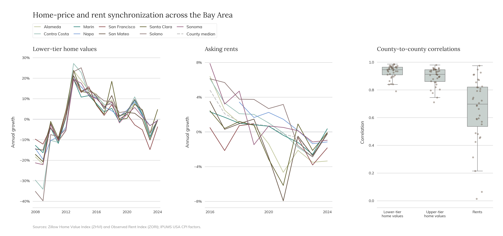

Historically cheaper areas did remain cheaper. But the size of that discount changed over time rather than steadily increasing. For owner-reported home values, the gap between historically low-cost areas and the rest of the region was larger in 2017–19 than either before or after. Rent discounts were smaller and changed less.

| Discount in historically low-cost areas | 2007-09 | 2017-19 | 2022-24 |
| :-------------------------------------- | ------: | ------: | ------: |
| Gross rent                              | 26.8264 | 28.4048 |  22.658 |
| Owner-reported home value               | 42.4809 | 55.0396 | 43.6923 |

Longer commutes also provided surprisingly little additional housing. After adjusting for household and housing characteristics, an extra ten minutes of commuting was associated with only a very small increase in bedrooms and almost no consistent difference in rent. It was associated with a somewhat higher probability of homeownership, suggesting that some households did trade travel time for the ability to buy rather than for substantially larger or cheaper housing.

| Adjusted association per 10 additional commute minutes | 2007-09  | 2017-19  | 2022-24  |
| :----------------------------------------------------- | :------- | :------- | :------- |
| Additional bedrooms                                    | +0.010   | +0.010   | +0.026   |
| Rent difference                                        | +0.13%   | -0.11%   | +0.43%   |
| Ownership probability difference                       | +0.67 pp | +1.74 pp | +1.43 pp |

The Bay Area therefore did offer cheaper places to live, but moving farther out did not provide a simple escape from the broader regional market. Home prices moved together across counties, rent savings were limited, and longer commutes bought relatively little additional space.

## Conclusion

The Bay Area housing market changed considerably between 2007 and 2024, but not in one direction. The financial crisis briefly made buying much easier. Falling prices and lower mortgage rates allowed far more renters to clear the basic financial requirements of ownership. That period ended as prices recovered, and the later increase in interest rates made buying difficult for a different reason. Over the same period, the households actually purchasing homes became increasingly high-income. Homeowners became older, more households remained in the same dwelling for long periods, and those who stayed often had substantially lower housing costs than households entering a new arrangement. When mortgage rates rose, existing owners had an additional reason not to move because replacing an older loan could mean taking on a much larger monthly payment.

Meanwhile, population loss did not relieve the market as much as the headline numbers might suggest. Smaller households increased the number of occupied homes, and housing prices continued to move together across much of the region. The divide that matters most by 2024 is therefore not simply between people with high and low incomes. It is also between households that already have a favorable position in the housing market and those trying to establish one now. High prices affect both groups, but they do not experience them in the same way. Someone who bought years ago, refinanced at a low rate, or has remained in the same rental for a decade can be relatively insulated from the market around them. A household trying to buy the same home today is not.

[^1]: [NBC Bay Area](https://www.nbcbayarea.com/news/local/bay-area-median-home-prices/3574226/)
